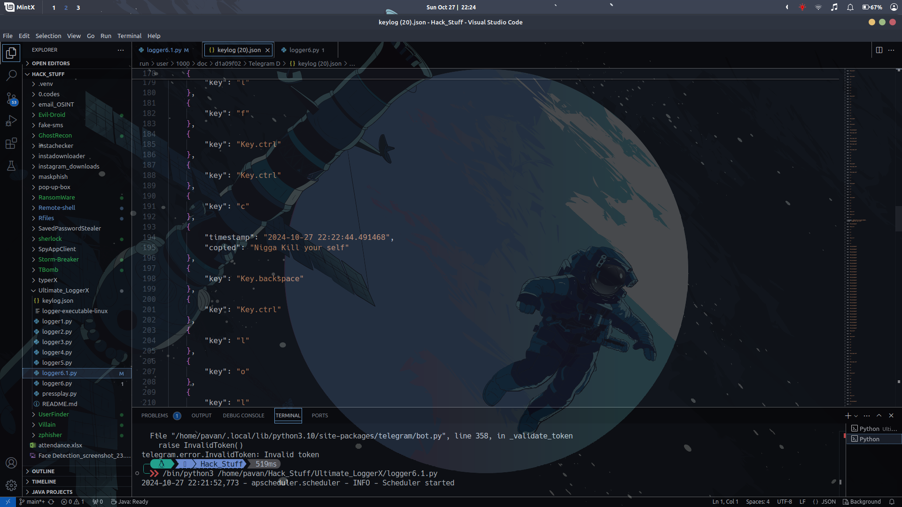
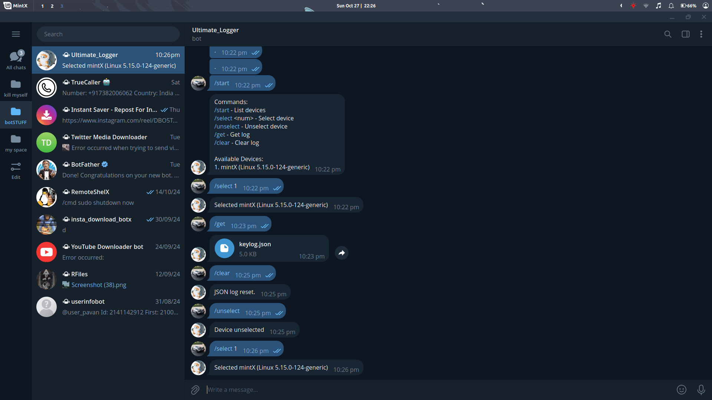

# Keylogger with Clipboard and Telegram Bot Integration

This project is a **cross-platform KeyLogger** that tracks keystrokes, clipboard content, and logs events in a hidden JSON file. The JSON file can be retrieved or reset via a Telegram bot. This tool is intended for **educational purposes only**, allowing cybersecurity professionals to test keylogging detection capabilities on antivirus software.

## Features

- **Keystroke Logging**: Tracks keystrokes with real-time logging and timestamps.
- **Clipboard Monitoring**: Logs clipboard content when it changes.
- **Caps Lock Detection**: Detects Caps Lock status for accurate character capture.
- **Telegram Bot Control**: Interact with the tool using a Telegram bot to:
  - `/get` - Download the JSON file with logs.
  - `/clear` - Reset the JSON log file (a new file is created automatically).

> ⚠ **Warning**: This tool is designed strictly for testing and educational purposes. Unauthorized use of this tool may violate privacy and legal policies in various regions. Use only with permission on devices you own or are authorized to test on.

---

## Setup Instructions

### Prerequisites

Install Python (3.7+) and ensure `pip` is available for package installations.

### Required Packages

Install necessary packages via `pip`:
```bash
pip install os json pyperclip pynput platform python-telegram-bot
```
## Telegram Bot Setup

- Create a new bot on Telegram [BotFather](https://t.me/BotFather) and obtain the bot token.
- Replace `"YOUR_TELEGRAM_BOT_TOKEN"` in the code with your bot token.

### Platform-Specific Instructions

#### Windows

- Clone this repository.
- Run the script with Python:
  ```bash
  python logger5.py
  ```
- To compile into an executable, use:
  ```bash
  pyinstaller --onefile logger5.py
  ```

#### MAC

- Clone this repository.
- Run the script with Python:
  ```bash
  python3 logger5.py
  ```
- To compile into an executable, use:
  ```bash
  pyinstaller --onefile --windowed logger5.py

  ```

  #### Linux

- Clone this repository.
- Run the script with Python:
  ```bash
  python3 logger5.py
  ```
- To compile into an executable, use:
  ```bash
  pyinstaller --onefile logger5.py
  ```

## 📸 Screenshots

Here's what the LoggerX looks like in action:


*Running the bot*


*Using the bot through Telegram*

### Usage Warning
This tool is intended for legal, authorized use only. Unauthorized use of keyloggers can violate local, state, and federal privacy and data laws. Always obtain proper permissions before monitoring any device.